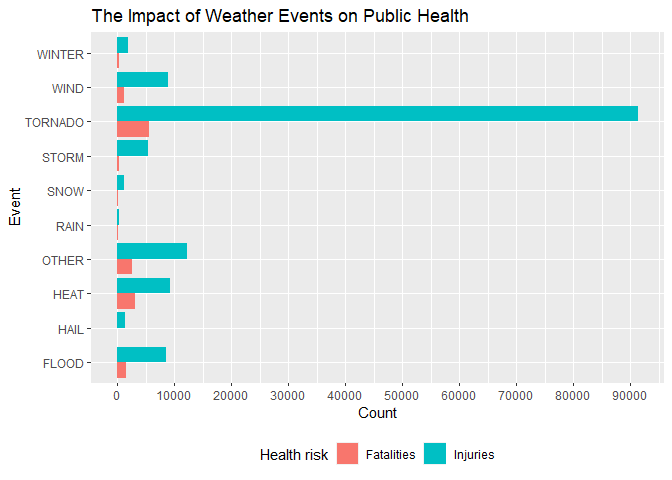
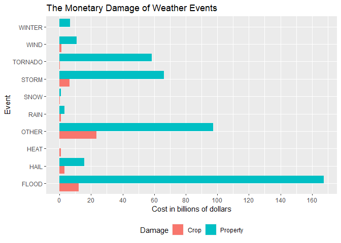

# **Introduction**

This project explores the United States National Oceanic and Atmospheric Administration's (NOAA) storm database. It contains information of major storms and weather events ocurring in the U.S. These events, not surprisingly, can have big health and economic impacts for small communities and big cities alike. Many events can result in property damage, injuries or even death. 

This analysis concludes that it is tornadoes, that have the greatest health impact (measured by injuries and fatalities), while floods are the ones that cause the most economic damage (measured by property damage and crop damage).

The basic goal of this assignment is to explore the NOAA Storm Database and answer some basic questions about severe weather events.

- Across the United States, which types of events are most harmful with respect to population health?
- Across the United States, which types of events have the greatest economic consequences?

# **Assignment**

## Preparing the environment
In order to facilitate working with the datasets, the following libraries will be used:

```r
library(ggplot2)
library(plyr)
library(dplyr)
```

## Data Information
The data for this project comes in the form of a comma-separated-value file compressed via the bzip2 algorithm to reduce its size. You can download the file from [here](https://github.com/JerryMN/CourseraDataScience/raw/gh-pages/5_Reproducible_Research/Project%202/repdata_data_StormData.csv.bz2).

Documentation on this data can be found [here](https://d396qusza40orc.cloudfront.net/repdata%2Fpeer2_doc%2Fpd01016005curr.pdf) and [here](https://d396qusza40orc.cloudfront.net/repdata%2Fpeer2_doc%2FNCDC%20Storm%20Events-FAQ%20Page.pdf).

The events in the database start in the year 1950 and end in November 2011. In the earlier years of the database there are generally fewer events recorded, most likely due to a lack of good records. More recent years should be considered more complete.

## Downloading files
The data will be automatically downloaded and read if it does not already exist.

```r
if(!exists("storm_data")){
        if(!file.exists("repdata_data_StormData.csv.bz2")){
                download.file(url="https://d396qusza40orc.cloudfront.net/repdata%2Fdata%2FStormData.csv.bz2",
                              destfile = "repdata_data_StormData.csv.bz2")
        }
        storm_data <- read.csv(bzfile("repdata_data_StormData.csv.bz2"), header = T)
}
```

## Subsetting the data
Reading the documentation, we can see that not all variables in the dataset are of our interest. The ones that are however, are:

#### Health
- FATALITIES
- INJURIES

#### Economic
- PROPDMG (property damage)
- PROPDMGEXP (units for PROPDMG)
- CROPDMG (crop damage)
- CROPDMGEXP (units for CROPDMG)

#### Events
- EVTYPE (the specific weather event)

So, we will filter for only these variables.

```r
mydata <- subset(storm_data, select = c(FATALITIES, INJURIES, PROPDMG, PROPDMGEXP, CROPDMG, CROPDMGEXP, EVTYPE))
```

Now we check for missing values in the data.

```r
sum(is.na(mydata))
```

```
## [1] 0
```

There are no missing values at all, so we can proceed with the transformation without the need of imputing values.

## Transforming the data

The **EVTYPE** variable contains 985 unique values or levels.

```r
str(as.factor(mydata$EVTYPE))
```

```
##  Factor w/ 985 levels "   HIGH SURF ADVISORY",..: 834 834 834 834 834 834 834 834 834 834 ...
```

As such, we will group them into 9 main categories since most of these are really closely related (for example *Storm* and *Thunderstorm*). The rest of levels the will go to the **OTHER** category.

```r
mydata$EVENT <- "OTHER"
mydata$EVENT[grep("HAIL", mydata$EVTYPE, ignore.case = T)] <- "HAIL"
mydata$EVENT[grep("HEAT", mydata$EVTYPE, ignore.case = T)] <- "HEAT"
mydata$EVENT[grep("FLOOD", mydata$EVTYPE, ignore.case = T)] <- "FLOOD"
mydata$EVENT[grep("WIND", mydata$EVTYPE, ignore.case = T)] <- "WIND"
mydata$EVENT[grep("STORM", mydata$EVTYPE, ignore.case = T)] <- "STORM"
mydata$EVENT[grep("SNOW", mydata$EVTYPE, ignore.case = T)] <- "SNOW"
mydata$EVENT[grep("TORNADO", mydata$EVTYPE, ignore.case = T)] <- "TORNADO"
mydata$EVENT[grep("WINTER", mydata$EVTYPE, ignore.case = T)] <- "WINTER"
mydata$EVENT[grep("RAIN", mydata$EVTYPE, ignore.case = T)] <- "RAIN"
mydata$EVTYPE <- NULL
table(mydata$EVENT)
```

```
## 
##   FLOOD    HAIL    HEAT   OTHER    RAIN    SNOW   STORM TORNADO    WIND  WINTER 
##   82686  289270    2648   48970   12241   17660  113156   60700  255362   19604
```
We can see how many rows for any given categories we have.

Next, looking at the **PROPDMGEXP** and **CROPDMGEXP** variables, we find insconsistencies in the levels of the data.

```r
sort(table(mydata$PROPDMGEXP))
```

```
## 
##      -      8      h      3      4      6      +      7      H      m      ? 
##      1      1      1      4      4      4      5      5      6      7      8 
##      2      1      5      B      0      M      K        
##     13     25     28     40    216  11330 424665 465934
```

```r
sort(table(mydata$CROPDMGEXP))
```

```
## 
##      2      m      ?      B      0      k      M      K        
##      1      1      7      9     19     21   1994 281832 618413
```

Since the documentation doesn't provide information on this matter, a new codification will be made, where:

- **K** or **k**: thousands of dollars (or 10^3)
- **M** or **m**: millions of dollars (or 10^6)
- **B** or **b**: billions of dollars (or 10^9)
- Everything else (including missing values): single dollars

A new column will be added to get the actual numerical cost e.g. 25K will now be 25000, etc. while removing the other, now obsolete columns.

```r
mydata$PROPDMGEXP[!grepl("K|M|B", mydata$PROPDMGEXP, ignore.case = T)] <- 0
mydata$PROPDMGEXP[grep("K", mydata$PROPDMGEXP, ignore.case = T)] <- "3"
mydata$PROPDMGEXP[grep("M", mydata$PROPDMGEXP, ignore.case = T)] <- "6"
mydata$PROPDMGEXP[grep("B", mydata$PROPDMGEXP, ignore.case = T)] <- "9"
mydata$PROPDMGEXP <- as.numeric(mydata$PROPDMGEXP)
mydata$PROPDMG <- mydata$PROPDMG * 10^mydata$PROPDMGEXP
mydata$PROPDMGEXP <- NULL

mydata$CROPDMGEXP[!grepl("K|M|B", mydata$CROPDMGEXP, ignore.case = T)] <- 0
mydata$CROPDMGEXP[grep("K", mydata$CROPDMGEXP, ignore.case = T)] <- "3"
mydata$CROPDMGEXP[grep("M", mydata$CROPDMGEXP, ignore.case = T)] <- "6"
mydata$CROPDMGEXP[grep("B", mydata$CROPDMGEXP, ignore.case = T)] <- "9"
mydata$CROPDMGEXP <- as.numeric(mydata$CROPDMGEXP)
mydata$CROPDMG <- mydata$CROPDMG * 10^mydata$CROPDMGEXP
mydata$CROPDMGEXP <- NULL
head(mydata)
```

```
##   FATALITIES INJURIES PROPDMG CROPDMG   EVENT
## 1          0       15   25000       0 TORNADO
## 2          0        0    2500       0 TORNADO
## 3          0        2   25000       0 TORNADO
## 4          0        2    2500       0 TORNADO
## 5          0        2    2500       0 TORNADO
## 6          0        6    2500       0 TORNADO
```
We now have the **PROPDMG** and **CROPDMG** columns that have the actual damage.

## Analysis

### Aggregates

We create a table of fatalities and injuries by event

```r
agg_fatalities <- ddply(mydata, "EVENT", summarize, TOTAL = sum(FATALITIES))
agg_fatalities$Type <- "Fatalities"
agg_injuries <- ddply(mydata, "EVENT", summarize, TOTAL = sum(INJURIES))
agg_injuries$Type <- "Injuries"
agg_health <- rbind(agg_fatalities, agg_injuries)
agg_health
```

```
##      EVENT TOTAL       Type
## 1    FLOOD  1524 Fatalities
## 2     HAIL    15 Fatalities
## 3     HEAT  3138 Fatalities
## 4    OTHER  2626 Fatalities
## 5     RAIN   114 Fatalities
## 6     SNOW   164 Fatalities
## 7    STORM   416 Fatalities
## 8  TORNADO  5661 Fatalities
## 9     WIND  1209 Fatalities
## 10  WINTER   278 Fatalities
## 11   FLOOD  8602   Injuries
## 12    HAIL  1371   Injuries
## 13    HEAT  9224   Injuries
## 14   OTHER 12224   Injuries
## 15    RAIN   305   Injuries
## 16    SNOW  1164   Injuries
## 17   STORM  5339   Injuries
## 18 TORNADO 91407   Injuries
## 19    WIND  9001   Injuries
## 20  WINTER  1891   Injuries
```

And another table of property damage and crop damage by event

```r
agg_prop <- ddply(mydata, "EVENT", summarize, TOTAL = sum(PROPDMG))
agg_prop$Type <- "Property"
agg_crop <- ddply(mydata, "EVENT", summarize, TOTAL = sum(CROPDMG))
agg_crop$Type <- "Crop"
agg_eco <- rbind(agg_prop, agg_crop)
agg_eco
```

```
##      EVENT        TOTAL     Type
## 1    FLOOD 167502193929 Property
## 2     HAIL  15733043048 Property
## 3     HEAT     20325750 Property
## 4    OTHER  97246712337 Property
## 5     RAIN   3270230192 Property
## 6     SNOW   1024169752 Property
## 7    STORM  66304415393 Property
## 8  TORNADO  58593098029 Property
## 9     WIND  10847166618 Property
## 10  WINTER   6777295251 Property
## 11   FLOOD  12266906100     Crop
## 12    HAIL   3046837473     Crop
## 13    HEAT    904469280     Crop
## 14   OTHER  23588880870     Crop
## 15    RAIN    919315800     Crop
## 16    SNOW    134683100     Crop
## 17   STORM   6374474888     Crop
## 18 TORNADO    417461520     Crop
## 19    WIND   1403719150     Crop
## 20  WINTER     47444000     Crop
```

## Results

### Across the United States, which types of events are most harmful with respect to population health?

```r
ggplot(agg_health, aes(EVENT, TOTAL, fill = Type)) + geom_col(position = "dodge") +
        labs(x = "Event", y = "Count", title = "The Impact of Weather Events on Public Health", 
             fill = "Health risk") + coord_flip() + theme(legend.position = "bottom") +
        scale_y_continuous(breaks = seq(0, 100000, 10000))
```

<!-- -->

It is clear from this graph, that tornadoes are, by far, the most harmful weather event to the population health, both in injuries and in fatalities. 

### Across the United States, which types of events have the greatest economic consequences?

```r
ggplot(agg_eco, aes(EVENT, TOTAL/10^9, fill = Type)) + geom_col(position = "dodge") +
        labs(x = "Event", y = "Cost in billions of dollars", title = "The Monetary Damage of Weather Events",
             fill = "Damage") + coord_flip() + theme(legend.position = "bottom") + 
        scale_y_continuous(breaks = seq(0,180,20))
```

<!-- -->

Here we can appreciate that the 3 most devastating weather event regarding property damage are FLOODS, followed by OTHER, and then STORMS

When looking at crop damage, the 3 most costly weather events are OTHER, FLOODS and STORMS 

# **Conclusion**

It is very evident that measures need to be put in place to protect the population from getting injured because of tornadoes. While 90,000 is not an absurdly large number for all tornado injuries since the 1950's, it is a number ~6 times as big as all the events in the "OTHER" category *combined*!

The same could be said for the quality of buildings when having to deal with large bodies of water. It is an interesting finding that floods are more than twice as expensive as tornadoes, and the latter seem way more devastating at first glance. 
