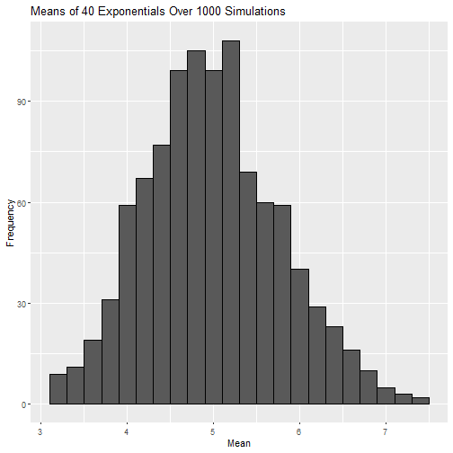
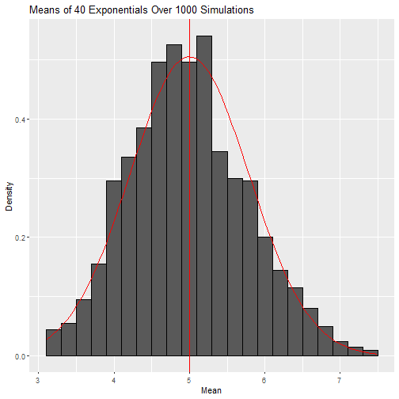

# Overview
The purpose of this document is to demostrate knowledge acquired in the Statistical Inference Coursera Course, and specifically the Central Limit Theorem (CLT) and how it relates to the exponential distribution. 
This first part of the project will focus on the distribution of 40 exponentials over one thousand different simulations. Note that I will use **set.seed(1)** to ensure reproducibility.

# Part 1: Simulations

```r
# Predefined parameters
lambda <- 0.2
n <- 40
sims <- 1:1000
set.seed(1)

population <- data.frame(x=sapply(sims, function(x) {mean(rexp(n, lambda))}))
ggplot(population, aes(x=x)) + geom_histogram(aes(y=..count..), binwidth = 0.2, col = "black") +
    labs(x = "Mean", y = "Frequency", title = "Means of 40 Exponentials Over 1000 Simulations")
```


Here I have plotted a histogram detailing the means of this 40 exponentials, sampled one thousand  times. For now, we can see it appears to follow a normal distribution but we need to support this with data. So we will compare the theoretical mean (1/lambda) with the mean of the sample, and the same with the variance. At last, we will see in a graphical manner, the difference between these theoretical values and the sample values.  

## Mean compatison: Sample vs Theoretical

```r
sample_mean <- mean(population$x)
theo_mean <- 1/lambda
cbind(sample_mean, theo_mean)
```

```
##      sample_mean theo_mean
## [1,]    4.990025         5
```

```r
t.test(population$x)[4]
```

```
## $conf.int
## [1] 4.941515 5.038536
## attr(,"conf.level")
## [1] 0.95
```
With a confidence interval of 95%, the sample mean is between 4.96 and 5.06.

## Variance comparison: Sample vs Theoretical

```r
sample_variance <- var(population$x)
theo_variance <- ((1/lambda)^2)/n
cbind(sample_variance, theo_variance)
```

```
##      sample_variance theo_variance
## [1,]       0.6111165         0.625
```
As is the case with the mean, the variances are also close to each other. 

## Is the distribution normal?

```r
ggplot(population, aes(x=x)) + 
    geom_histogram(aes(y=..density..), binwidth = 0.2, col = "black") +
    labs(x = "Mean", y = "Density", title = "Means of 40 Exponentials Over 1000 Simulations") +
    stat_function(fun=dnorm,args=list(mean = 1/lambda, sd = sqrt(theo_variance)), color = "red") +
    geom_vline(xintercept=theo_mean, colour="red")
```



Visually, we can tell that the histogram's density function is really close to the red, theoretical curve. Therefore, anc coupled with the previous information, we can conclude that the sample is approximately normally distributed. 
