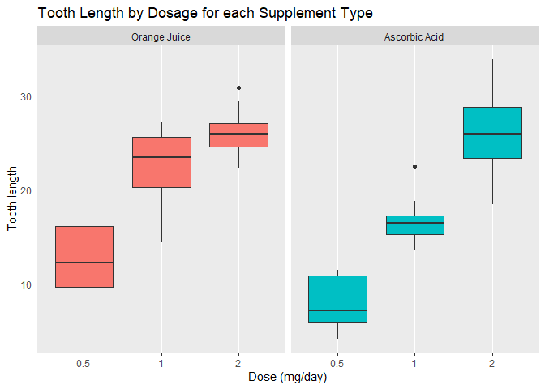

**Part 2: Basic Inferential Data Analysis**
===========================================

Overview
========

This second part of the project will focus on exploring the ToothGrowth
data, present in the *datasets* library. More specifically, we will
compare the tooth growth by supp and dose, using techniques learned in
the Course.

Loading the data
----------------

    library(datasets)
    data("ToothGrowth")
    str(ToothGrowth)

    ## 'data.frame':    60 obs. of  3 variables:
    ##  $ len : num  4.2 11.5 7.3 5.8 6.4 10 11.2 11.2 5.2 7 ...
    ##  $ supp: Factor w/ 2 levels "OJ","VC": 2 2 2 2 2 2 2 2 2 2 ...
    ##  $ dose: num  0.5 0.5 0.5 0.5 0.5 0.5 0.5 0.5 0.5 0.5 ...

The **len** column describes the length of odontoblasts in guinea pigs,
the **sup** column describes the type of suplement received (orange
juice and ascorbic acid), and the **dose** column represents the mg/day
of the supplement.

Exploratory Data Analysis
-------------------------

    t = ToothGrowth
    levels(t$supp) <- c("Orange Juice", "Ascorbic Acid")
    ggplot(t, aes(factor(dose), len)) + 
        geom_boxplot(aes(fill = supp), show.legend = FALSE) +
        labs(x = "Dose (mg/day)", y = "Tooth length", title = "Tooth Length by Dosage for each Supplement Type") +
        facet_grid(.~supp)

Basic Summary of the Data
-------------------------

The above boxplot shows that increasing the supplement dose seems to aid
in the increase in tooth growth, with orange juice being seemingly more
efective, especially at the lower dosages. However, at 2 mg/day, both
supplements appear to be equally as effective.

Comparison of Tooth Growth by Supplement and Dose
-------------------------------------------------

### *Hypothesis 1: Both supplements perform equally across the dataset.*

### *H\_0: Orange Juice = Ascorbic Acid*

### *H\_a: Orange Juice &gt; Ascorbic Acid*

    hyp1 <- t.test(len ~ supp, data = t)
    hyp1$conf.int

    ## [1] -0.1710156  7.5710156
    ## attr(,"conf.level")
    ## [1] 0.95

    hyp1$p.value

    ## [1] 0.06063451

The confidence interval contains 0, and the p-value exceeds the alpha
value of 0.05, thus the null hypothesis cannot be rejected. Both
supplements perform equally across the dataset.

### *Hypothesis 2: For a 0.5 mg/day dosage, both supplements perform equally.*

### *H\_0: Orange Juice = Ascorbic Acid*

### *H\_a: Orange Juice &gt; Ascorbic Acid*

    hyp2 <- t.test(len ~ supp, data = subset(t, dose == 0.5))
    hyp2$conf.int

    ## [1] 1.719057 8.780943
    ## attr(,"conf.level")
    ## [1] 0.95

    hyp2$p.value

    ## [1] 0.006358607

The confidence interval doesn’t contain 0, and the p-value is below the
alpha value of 0.05, thus the null hypothesis cannot be accepted. The
alternative hyptohesis that orange juice performs better than ascorbic
acid at a dosage level of 0.5 mg/day is accepted.

### *Hypothesis 3: For a 1 mg/day dosage, both supplements perform equally.*

### *H\_0: Orange Juice = Ascorbic Acid*

### *H\_a: Orange Juice &gt; Ascorbic Acid*

    hyp3 <- t.test(len ~ supp, data = subset(t, dose == 1))
    hyp3$conf.int

    ## [1] 2.802148 9.057852
    ## attr(,"conf.level")
    ## [1] 0.95

    hyp3$p.value

    ## [1] 0.001038376

The confidence interval doesn’t contain 0, and the p-value is below the
alpha value of 0.05, thus the null hypothesis cannot be accepted. The
alternative hyptohesis that orange juice performs better than ascorbic
acid at a dosage level of 1 mg/day is accepted.

### *Hypothesis 4: For a 2 mg/day dosage, both supplements perform equally.*

### *H\_0: Orange Juice = Ascorbic Acid*

### *H\_a: Orange Juice &gt; Ascorbic Acid*

    hyp4 <- t.test(len ~ supp, data = subset(t, dose == 2))
    hyp4$conf.int

    ## [1] -3.79807  3.63807
    ## attr(,"conf.level")
    ## [1] 0.95

    hyp4$p.value

    ## [1] 0.9638516

The confidence interval contains 0, and the p-value is way above the
alpha value of 0.05, thus the null hypothesis cannot be rejected. Both
supplements perform equally at a dosage level of 2 mg/day.

Conclusions and Assumptions
---------------------------

We assume that the tooth lengths are distributed normally and that no
other factors are affecting said tooth lengths. With these, we can
conclude that orange juice is more effective at increasing the tooth
length than ascorbic acid when using dosages of 0.5 and 1 mg/day. At 2
mg/day however, there is no evidence to suggest that either supplement
is better than the other. Lastly, when looking at the complete set of
data, this last statement holds up: both supplements perform
statistically equal.
