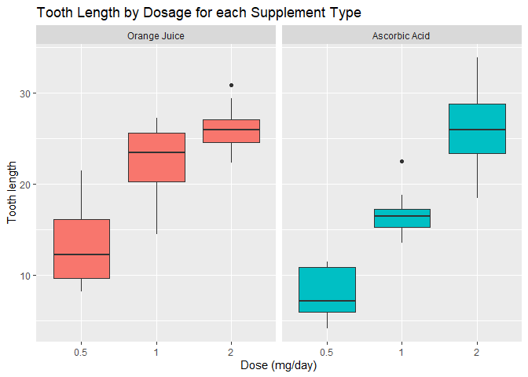

---
title: "Statistical Inference Course Project"
author: "Gerardo Mondragón"
date: "8/5/2020"
output: 
    html_document:
        keep_md: true
---     


# **Part 2: Basic Inferential Data Analysis**

# **Introduction**

This second part of the project will focus on exploring the ToothGrowth data, present in the *datasets* library. More specifically, we will compare the tooth growth by supp and dose, using techniques learned in the Course.

# **Assignment**

## Loading the data

```r
library(datasets)
data("ToothGrowth")
str(ToothGrowth)
```

```
## 'data.frame':	60 obs. of  3 variables:
##  $ len : num  4.2 11.5 7.3 5.8 6.4 10 11.2 11.2 5.2 7 ...
##  $ supp: Factor w/ 2 levels "OJ","VC": 2 2 2 2 2 2 2 2 2 2 ...
##  $ dose: num  0.5 0.5 0.5 0.5 0.5 0.5 0.5 0.5 0.5 0.5 ...
```
The **len** column describes the length of odontoblasts in guinea pigs, the **sup** column describes the type of suplement received (orange juice and ascorbic acid), and the **dose** column represents the mg/day of the supplement.

## Exploratory Data Analysis

```r
t = ToothGrowth
levels(t$supp) <- c("Orange Juice", "Ascorbic Acid")
ggplot(t, aes(factor(dose), len)) + 
    geom_boxplot(aes(fill = supp), show.legend = FALSE) +
    labs(x = "Dose (mg/day)", y = "Tooth length", title = "Tooth Length by Dosage for each Supplement Type") +
    facet_grid(.~supp)
```

<!-- -->

## Basic Summary of the Data
The above boxplot shows that increasing the supplement dose seems to aid in the increase in tooth growth, with orange juice being seemingly more efective, especially at the lower dosages. However, at 2 mg/day, both supplements appear to be equally as effective.

## Comparison of Tooth Growth by Supplement and Dose
### *Hypothesis 1: Both supplements perform equally across the dataset.*
### *H_0: Orange Juice = Ascorbic Acid*
### *H_a: Orange Juice > Ascorbic Acid*

```r
hyp1 <- t.test(len ~ supp, data = t)
hyp1$conf.int
```

```
## [1] -0.1710156  7.5710156
## attr(,"conf.level")
## [1] 0.95
```

```r
hyp1$p.value
```

```
## [1] 0.06063451
```
The confidence interval contains 0, and the p-value exceeds the alpha value of 0.05, thus the null hypothesis cannot be rejected. Both supplements perform equally across the dataset. 

### *Hypothesis 2: For a 0.5 mg/day dosage, both supplements perform equally.*
### *H_0: Orange Juice = Ascorbic Acid*
### *H_a: Orange Juice > Ascorbic Acid*

```r
hyp2 <- t.test(len ~ supp, data = subset(t, dose == 0.5))
hyp2$conf.int
```

```
## [1] 1.719057 8.780943
## attr(,"conf.level")
## [1] 0.95
```

```r
hyp2$p.value
```

```
## [1] 0.006358607
```
The confidence interval doesn't contain 0, and the p-value is below the alpha value of 0.05, thus the null hypothesis cannot be accepted. The alternative hyptohesis that orange juice performs better than ascorbic acid at a dosage level of 0.5 mg/day is accepted. 


### *Hypothesis 3: For a 1 mg/day dosage, both supplements perform equally.*
### *H_0: Orange Juice = Ascorbic Acid*
### *H_a: Orange Juice > Ascorbic Acid*

```r
hyp3 <- t.test(len ~ supp, data = subset(t, dose == 1))
hyp3$conf.int
```

```
## [1] 2.802148 9.057852
## attr(,"conf.level")
## [1] 0.95
```

```r
hyp3$p.value
```

```
## [1] 0.001038376
```
The confidence interval doesn't contain 0, and the p-value is below the alpha value of 0.05, thus the null hypothesis cannot be accepted. The alternative hyptohesis that orange juice performs better than ascorbic acid at a dosage level of 1 mg/day is accepted. 

### *Hypothesis 4: For a 2 mg/day dosage, both supplements perform equally.*
### *H_0: Orange Juice = Ascorbic Acid*
### *H_a: Orange Juice > Ascorbic Acid*

```r
hyp4 <- t.test(len ~ supp, data = subset(t, dose == 2))
hyp4$conf.int
```

```
## [1] -3.79807  3.63807
## attr(,"conf.level")
## [1] 0.95
```

```r
hyp4$p.value
```

```
## [1] 0.9638516
```
The confidence interval contains 0, and the p-value is way above the alpha value of 0.05, thus the null hypothesis cannot be rejected. Both supplements perform equally at a dosage level of 2 mg/day.

# **Conclusions and Assumptions**
We assume that the tooth lengths are distributed normally and that no other factors are affecting said tooth lengths.
With these, we can conclude that orange juice is more effective at increasing the tooth length than ascorbic acid when using dosages of 0.5 and 1 mg/day. At 2 mg/day however, there is no evidence to suggest that either supplement is better than the other.
Lastly, when looking at the complete set of data, this last statement holds up: both supplements perform statistically equal. 
