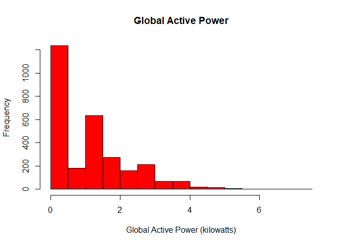
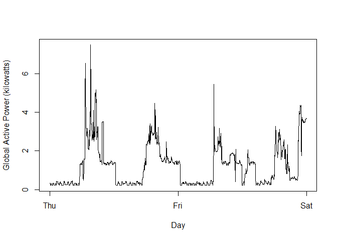
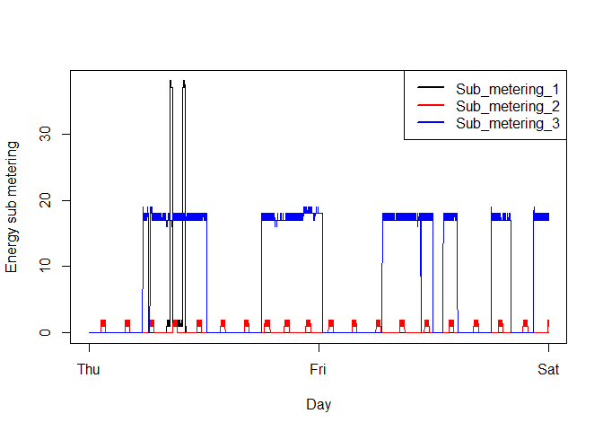
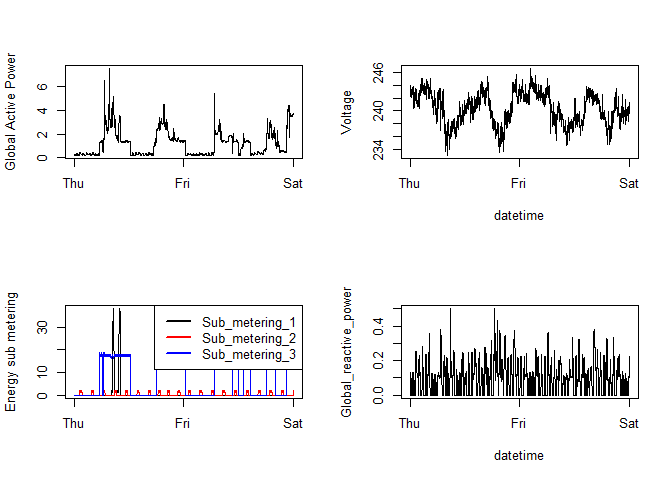

# **Introduction** 

This assignment uses data from the UC Irvine Machine Learning Repository, in particular, the “Individual household electric power consumption Data Set” which has measurements of electric power consumption in one household with a one-minute sampling rate over a period of almost 4 years. 

The overall goal here is simply to examine how household energy usage varies over a 2-day period in February, 2007.

# **Assignment**

Bear in mind that I have disabled saving the plots as png files for this website's purposes. Buy you can add that functionality again by running:


```r
png("plotX.png", width=480, height=480)
# plotting code here
dev.off()
```

## Download zip

I am linking to my own repository in case the original file gets taken down. 


```r
url <- "https://github.com/JerryMN/CourseraDataScience/raw/gh-pages/4_Exploratory_Data_Analysis/Project%201/household_power_consumption.zip"

if(!file.exists("household_power_consumption.txt")) {
    tempFile <- tempfile()
    download.file(url, tempFile)
    unzip(tempFile)
    unlink(tempFile)
}

data <- read.table("household_power_consumption.txt", stringsAsFactors = F, header = T, sep = ";")
subsetdata <- data[data$Date %in% c("1/2/2007","2/2/2007") ,]
```

## Plot 1


```r
subsetdata$Global_active_power <- as.numeric(subsetdata$Global_active_power)

hist(subsetdata$Global_active_power, col="red", border="black", main ="Global Active Power", 
     xlab="Global Active Power (kilowatts)", ylab="Frequency")
```

<!-- -->

## Plot 2


```r
timedate <- strptime(paste(subsetdata$Date, subsetdata$Time, sep=" "), "%d/%m/%Y %H:%M:%S")
subsetdata$Global_active_power <- as.numeric(subsetdata$Global_active_power)

with(subsetdata, plot(timedate, Global_active_power, type="l", xlab="Day", ylab="Global Active Power (kilowatts)"))
```

<!-- -->

## Plot 3


```r
timedate <- strptime(paste(subsetdata$Date, subsetdata$Time, sep=" "), "%d/%m/%Y %H:%M:%S")
subsetdata <- cbind(subsetdata, timedate)
subsetdata$Sub_metering_1 <- as.numeric(subsetdata$Sub_metering_1)
subsetdata$Sub_metering_2 <- as.numeric(subsetdata$Sub_metering_2)
subsetdata$Sub_metering_3 <- as.numeric(subsetdata$Sub_metering_3)

with(subsetdata, plot(timedate, Sub_metering_1, type="l", xlab="Day", ylab="Energy sub metering"))
lines(subsetdata$timedate, subsetdata$Sub_metering_2,type="l", col= "red")
lines(subsetdata$timedate, subsetdata$Sub_metering_3,type="l", col= "blue")
legend(c("topright"), c("Sub_metering_1", "Sub_metering_2", "Sub_metering_3"), lty= 1, lwd=2, col = c("black", "red", "blue"))
```

<!-- -->

## Plot 4


```r
timedate <- strptime(paste(subsetdata$Date, subsetdata$Time, sep=" "), "%d/%m/%Y %H:%M:%S")
subsetdata <- cbind(subsetdata, timedate)

subsetdata$Global_active_power <- as.numeric(subsetdata$Global_active_power)
subsetdata$Voltage <- as.numeric(subsetdata$Voltage)
subsetdata$Sub_metering_1 <- as.numeric(subsetdata$Sub_metering_1)
subsetdata$Sub_metering_2 <- as.numeric(subsetdata$Sub_metering_2)
subsetdata$Sub_metering_3 <- as.numeric(subsetdata$Sub_metering_3)

par(mfrow=c(2,2))
with(subsetdata, plot(timedate, Global_active_power, type="l", xlab="", ylab="Global Active Power"))
with(subsetdata, plot(timedate, Voltage, type = "l", xlab="datetime", ylab="Voltage"))
with(subsetdata, plot(timedate, Sub_metering_1, type="l", xlab="", ylab="Energy sub metering"))
lines(subsetdata$timedate, subsetdata$Sub_metering_2,type="l", col= "red")
lines(subsetdata$timedate, subsetdata$Sub_metering_3,type="l", col= "blue")
legend(c("topright"), c("Sub_metering_1", "Sub_metering_2", "Sub_metering_3"), lty= 1, lwd=2, col = c("black", "red", "blue"))
with(subsetdata, plot(timedate, Global_reactive_power, type="l", xlab="datetime", ylab="Global_reactive_power"))
```

<!-- -->
