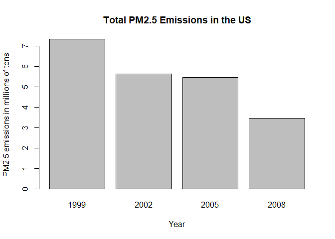
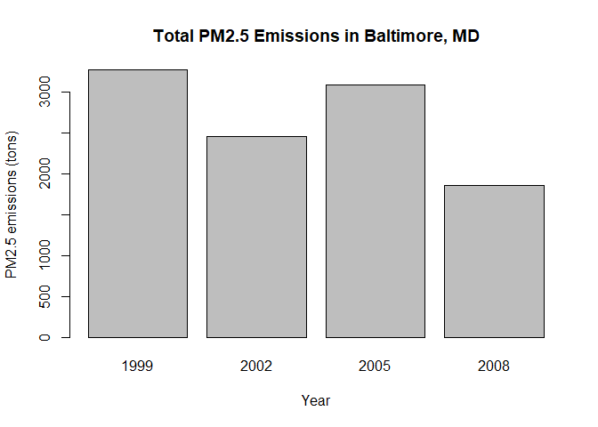
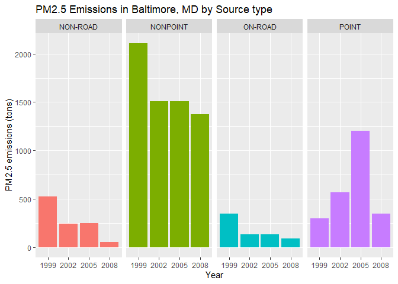
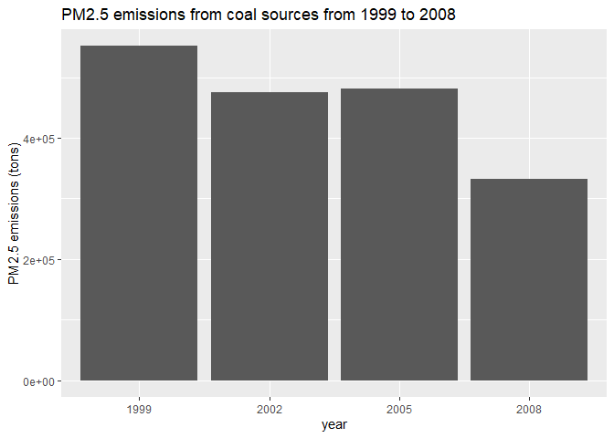
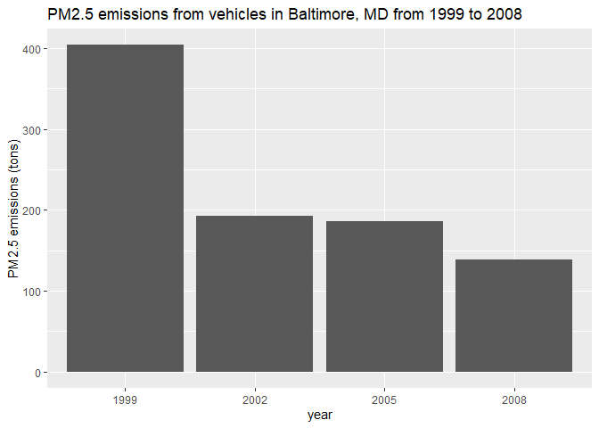
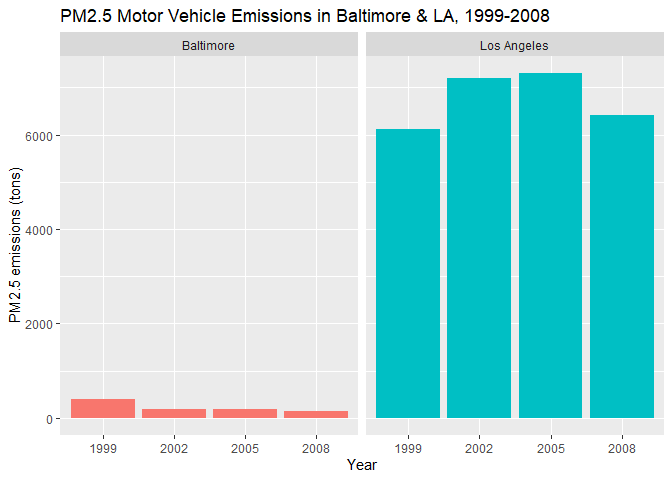

# **Introduction**

Fine particulate matter (PM2.5) is an ambient air pollutant for which there is strong evidence that it is harmful to human health. In the United States, the Environmental Protection Agency (EPA) is tasked with setting national ambient air quality standards for fine PM and for tracking the emissions of this pollutant into the atmosphere. Approximatly every 3 years, the EPA releases its database on emissions of PM2.5. This database is known as the National Emissions Inventory (NEI).

For each year and for each type of PM source, the NEI records how many tons of PM2.5 were emitted from that source over the course of the entire year. The data that used here are for 1999, 2002, 2005, and 2008.

# **Assignment**

Bear in mind that I have disabled saving the plots as png files for this website's purposes. Buy you can add that functionality again by running:


```r
png("plotX.png", width=480, height=480)
# plotting code here
dev.off()
```

## Download files

I am linking to my own repository in case the original files get taken down. 


```r
url <- "https://github.com/JerryMN/CourseraDataScience/raw/gh-pages/4_Exploratory_Data_Analysis/Project%202/Source_Classification_Code.rds"

if(!file.exists("Source_Classification_Code.rds")) {
    download.file(url, "Source_Classification_Code.rds")
}

url <- "https://github.com/JerryMN/CourseraDataScience/raw/gh-pages/4_Exploratory_Data_Analysis/Project%202/summarySCC_PM25.rds"
if(!file.exists("summarySCC_PM25.rds")) {
    download.file(url, "summarySCC_PM25.rds")

}

NEI <- readRDS("summarySCC_PM25.rds")
SCC <- readRDS("Source_Classification_Code.rds")
```

## Have total emissions from PM2.5 decreased in the United States from 1999 to 2008?


```r
totals <- aggregate(Emissions ~ year, NEI, sum)

barplot((totals$Emissions/10^6), names.arg = totals$year,
        xlab = "Year", ylab = "PM2.5 emissions in millions of tons",
        main = "Total PM2.5 Emissions in the US")
```

<!-- -->

## Have total emissions from PM2.5 decreased in Baltimore City, Maryland from 1999 to 2008?


```r
baltimore <- NEI[NEI$fips == "24510",]
totals_baltimore <- aggregate(Emissions ~ year, baltimore, sum)

barplot(totals_baltimore$Emissions, names.arg = totals_baltimore$year,
        xlab = "Year", ylab = "PM2.5 emissions (tons)",
        main = "Total PM2.5 Emissions in Baltimore, MD")
```

<!-- -->

## Of the four types of sources which of these have seen decreases in emissions from 1999–2008 for Baltimore City?


```r
baltimore <- NEI[NEI$fips == "24510",]

library(ggplot2)
ggplot(baltimore, aes(factor(year), Emissions, fill=type)) + 
        geom_bar(stat="identity") + 
        facet_grid(.~type) + 
        guides(fill=F) +
        labs(x="Year", y = "PM2.5 emissions (tons)", title = "PM2.5 Emissions in Baltimore, MD by Source type")
```

<!-- -->

## Across the United States, how have emissions from coal combustion-related sources changed from 1999–2008?


```r
NEISCC <- merge(NEI, SCC, by="SCC")
combustion <- grepl("comb", NEISCC$SCC.Level.One, ignore.case = T)
coal <- grepl("coal", NEISCC$SCC.Level.Four, ignore.case = T)
coalcomb <- (combustion & coal)
coalsub <- NEISCC[coalcomb, ]
totals <- aggregate(Emissions ~ year, coalsub, sum)

ggplot(totals, aes(factor(year), Emissions)) + 
        geom_bar(stat="identity") +
        labs(x = "year", y = "PM2.5 emissions (tons)", title = "PM2.5 emissions from coal sources from 1999 to 2008")
```

<!-- -->

## How have emissions from motor vehicle sources changed from 1999–2008 in Baltimore City?


```r
vehicles <- grepl("vehicle", NEISCC$SCC.Level.Two, ignore.case = T)
vehiclesub <- NEISCC[vehicles, ]
baltimore <- vehiclesub[vehiclesub$fips == "24510", ]

totals <- aggregate(Emissions ~ year, baltimore, sum)

ggplot(totals, aes(factor(year), Emissions)) + 
        geom_bar(stat="identity") +
        labs(x = "year", y = "PM2.5 emissions (tons)", 
             title = "PM2.5 emissions from vehicles in Baltimore, MD from 1999 to 2008")
```

<!-- -->

## Which city has seen greater changes over time in motor vehicle emissions, Los Angeles or Baltimore City?


```r
vehicles <- grepl("vehicle", NEISCC$SCC.Level.Two, ignore.case = T)
vehiclesub <- NEISCC[vehicles, ]
baltimore <- vehiclesub[vehiclesub$fips == "24510", ]
baltimore$city <- "Baltimore"
losangeles <- vehiclesub[vehiclesub$fips == "06037", ]
losangeles$city <- "Los Angeles"

cities <- rbind(losangeles, baltimore)

library(ggplot2)
ggplot(cities, aes(factor(year), Emissions, fill = city)) +
        geom_bar(stat="identity") +
        facet_grid(.~city) +
        guides(fill = F) +
        labs(x="Year", y="PM2.5 emissions (tons)", title = "PM2.5 Motor Vehicle Emissions in Baltimore & LA, 1999-2008")
```

<!-- -->
