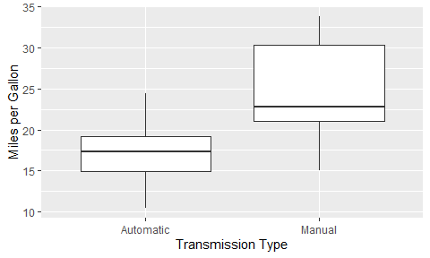
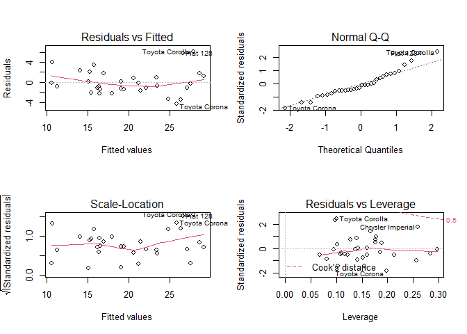

# **Introduction**
This report aims to solve questions concerning the miles per gallon performance and type of transmission. Specifically, is an automatic or manual transmission better for MPG? This difference will then be quantified. We will use the mtcars dataset in R to answer these questions. 

We can conclude that a manual transmission will yield more miles per gallon of fuel. However, the MPG variable is confounded by another two variables in the dataset: weight (a heavier vehicle consumes more fuel, thus less miles per gallon), and number of cylinders in the engine (more cylinders means using more fuel).

# **Assignment**

## Data Analysis
We will first load the data and other packages.

```r
library(ggplot2)
data(mtcars)
mtcars$vs <- factor(mtcars$vs)
mtcars$am.label <- factor(mtcars$am, labels=c("Automatic","Manual")) # 0 = Automatic, 1 = Manual
mtcars$gear <- factor(mtcars$gear)
mtcars$carb <- factor(mtcars$carb)
ggplot(mtcars, aes(mpg, am.label)) + geom_boxplot() + coord_flip() + labs(x= "Miles per Gallon", y = "Transmission Type")
```

<!-- -->

Outright we can see that manual transmissions have better MPG.

## Regression Analysis
Let's calculate the mean MPG for each transmission type.

```r
aggregate(mtcars$mpg, by = list(mtcars$am.label), mean)
```

```
##     Group.1        x
## 1 Automatic 17.14737
## 2    Manual 24.39231
```

Manual transmissions yield on average, 7 more miles per gallon than automatic transmissions. Let's create a linear regression model.

```r
reg <- summary(lm(mpg ~ factor(am.label), mtcars))
reg$coefficients[,4] # p-values
```

```
##            (Intercept) factor(am.label)Manual 
##           1.133983e-15           2.850207e-04
```

```r
reg$r.squared # R^2
```

```
## [1] 0.3597989
```

We can safely say that a manual transmission is better than an automatic transmission for MPG. However, we can see that the R^2 is around 0.36. So the transmission type accounts for only 36% of the variation. Let's do an ANOVA to see where the rest of the variance comes from.

```r
summary(aov(mpg ~ ., mtcars))
```

```
##             Df Sum Sq Mean Sq F value  Pr(>F)    
## cyl          1  817.7   817.7 102.591 2.3e-08 ***
## disp         1   37.6    37.6   4.717 0.04525 *  
## hp           1    9.4     9.4   1.176 0.29430    
## drat         1   16.5    16.5   2.066 0.16988    
## wt           1   77.5    77.5   9.720 0.00663 ** 
## qsec         1    3.9     3.9   0.495 0.49161    
## vs           1    0.1     0.1   0.016 0.90006    
## am           1   14.5    14.5   1.816 0.19657    
## gear         2    2.3     1.2   0.145 0.86578    
## carb         5   19.0     3.8   0.477 0.78789    
## Residuals   16  127.5     8.0                    
## ---
## Signif. codes:  0 '***' 0.001 '**' 0.01 '*' 0.05 '.' 0.1 ' ' 1
```

Those variables with a p-value < 0.05 are contributing factors to the variance of *mpg*. As such, we will shift our interest towards *cyl*, *disp* and *wt*. Let's do a multivariate regression with these variables.

```r
reg2 <- summary(lm(mpg ~ cyl + disp + wt + am, mtcars))
reg2$coefficients[,4] # p-values
```

```
##  (Intercept)          cyl         disp           wt           am 
## 8.677574e-12 7.581533e-03 5.450930e-01 5.468412e-03 9.229196e-01
```

```r
reg2$r.squared # R^2
```

```
## [1] 0.8326661
```

We can discard *disp* as a significant factor due to its p-value of 0.545. Additionally, the R^2 is now 0.83. Thus, we can account for 83% of the variance in *mpg* using this model. 

## Residual Plots and Analysis

```r
par(mfrow = c(2, 2))
plot(lm(mpg ~ cyl + disp + wt + am, mtcars))
```

<!-- -->

We can see from the Q-Q plot that the residuals are normally distributed, with a few outliers. Also, from the Resuduals vs Fitted plot, we can observe an homogenous variance. 
