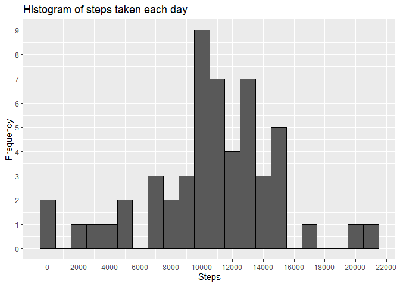
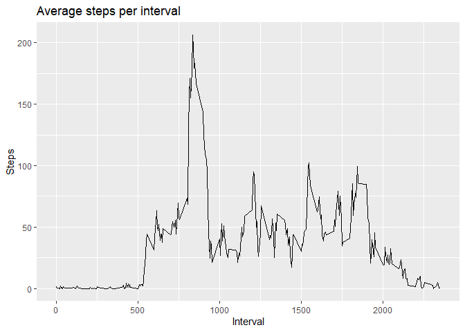
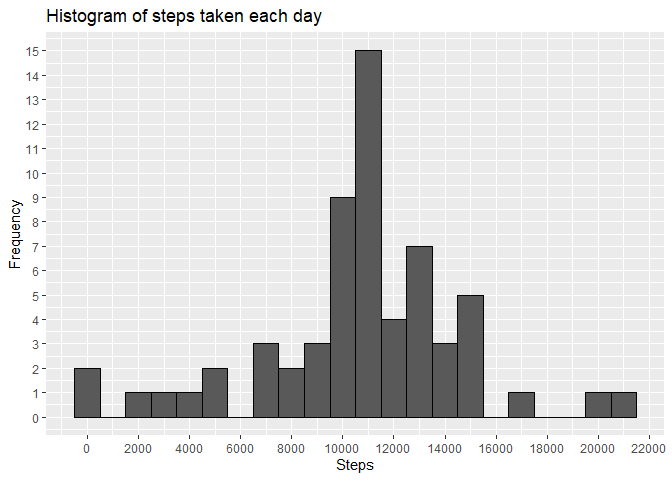
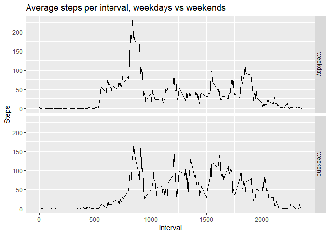

# **Introduction** 

It is now possible to collect a large amount of data about personal movement using activity monitoring devices such as a Fitbit, Nike Fuelband, or Jawbone Up. These type of devices are part of the “quantified self” movement – a group of enthusiasts who take measurements about themselves regularly to improve their health, to find patterns in their behavior, or because they are tech geeks. But these data remain under-utilized both because the raw data are hard to obtain and there is a lack of statistical methods and software for processing and interpreting the data.

This assignment makes use of data from a personal activity monitoring device. This device collects data at 5 minute intervals through out the day. The data consists of two months of data from an anonymous individual collected during the months of October and November, 2012 and include the number of steps taken in 5 minute intervals each day.

The goal of the assignment is to answer some questions, which will be outlined as we go through the document.

# **Assignment**

## Setup
We load some packages to help us further down the line.


```r
library(ggplot2)
library(dplyr)
```

## Downloading files

I am linking to my own repository in case the original file gets taken down. 

```r
url <- "https://github.com/JerryMN/CourseraDataScience/raw/gh-pages/5_Reproducible_Research/Project%201/activity.zip"

if(!file.exists("activity.csv")) {
    tempFile <- tempfile()
    download.file(url, tempFile)
    unzip(tempFile)
    unlink(tempFile)
}

data <- read.csv("activity.csv")
```

## What is the mean total number of steps taken per day?

### 1. Calculate the total number of steps taken per day
The data contains a lot of different readings for any given day. As such, we need to calculate the total number of steps per day. We do this using the **aggregate** function, grouping the **steps** component by **date**. We then rename the columns of this new data frame.

```r
steps_day <- aggregate(data$steps, list(data$date), sum)
names(steps_day) = c("date", "steps")
head(steps_day)
```

```
##         date steps
## 1 2012-10-01    NA
## 2 2012-10-02   126
## 3 2012-10-03 11352
## 4 2012-10-04 12116
## 5 2012-10-05 13294
## 6 2012-10-06 15420
```

### 2. Make a histogram of the total number of steps taken each day
Using **dplyr** and **ggplot** we construct a histogram. We remove NA values, set a bin width of 1,000 and change some other formatting parameters.

```r
steps_day %>% filter(!is.na(.$steps)) %>% ggplot(aes(steps)) + geom_histogram(binwidth = 1000, col = "black") + scale_x_continuous(breaks = seq(0,22000,2000)) + scale_y_continuous(breaks = seq(0,9,1)) + labs(x = "Steps", y = "Frequency", title = "Histogram of steps taken each day")
```

<!-- -->

### 3. Calculate and report the mean and median total number of steps taken per day
This is a very straightforward calculation using the **mean** and **median** functions, whilst removing all NA values.

```r
mean(steps_day$steps, na.rm = T)
```

```
## [1] 10766.19
```

```r
median(steps_day$steps, na.rm = T)
```

```
## [1] 10765
```

## What is the average daily activity pattern?

### 1. Create a table with the data
We need to create a table for the number of steps taken in each interval across all days. We use the **aggregate** function again.

```r
steps_time <- aggregate(steps~interval, data = data, FUN = mean)
```

### 2. Make a time series plot of the 5-minute interval (x-axis) and the average number of steps taken, averaged across all days (y-axis)
Again, we use the **ggplot** package to create the time series plot.

```r
ggplot(steps_time, aes(interval, steps)) + geom_line() + labs(x = "Interval", y = "Steps", title = "Average steps per interval")
```

<!-- -->

### 3. Which 5-minute interval, on average across all the days in the dataset, contains the maximum number of steps?
We use the **which.max** function to find the index of the maximum number of steps, and with this same index we find the interval to which it corresponds.

```r
steps_time$interval[which.max(steps_time$steps)]
```

```
## [1] 835
```

## Imputing missing values

### 1. Calculate and report the total number of missing values in the dataset
We use **sum** on **is.na** to count the number of NAs in the dataset.

```r
sum(is.na(data$steps))
```

```
## [1] 2304
```

### 2. Devise a strategy for filling in all of the missing values in the dataset
We will use the rounded averages across all days for the interval to fill missing values. If the steps column is an NA, then it will replace it with the rounded average, otherwise it leaves the original value. 

```r
data$complete <- ifelse(is.na(data$steps), round(steps_time$steps[match(data$interval, steps_time$interval)], 0), data$steps)
```

### 3. Create a new dataset that is equal to the original dataset but with the missing data filled in

```r
data_full <- data.frame(steps = data$complete, date = data$date, interval = data$interval)
head(data_full)
```

```
##   steps       date interval
## 1     2 2012-10-01        0
## 2     0 2012-10-01        5
## 3     0 2012-10-01       10
## 4     0 2012-10-01       15
## 5     0 2012-10-01       20
## 6     2 2012-10-01       25
```

### 4. Make a histogram of the total number of steps taken each day and Calculate and report the mean and median total number of steps taken per day. Do these values differ from the estimates from the first part of the assignment? What is the impact of imputing missing data on the estimates of the total daily number of steps?
As before, we use the **aggregate** function to sum all steps per day, rename the columns and then create a histogram using **ggplot**. The only difference in formatting is the upper limit of the y-axis. 

```r
steps_day_full <- aggregate(data_full$steps, list(data_full$date), sum)
names(steps_day_full) = c("date", "steps")
ggplot(steps_day_full, aes(steps)) + geom_histogram(binwidth = 1000, col = "black") + scale_x_continuous(breaks = seq(0,22000,2000)) + scale_y_continuous(breaks = seq(0,20,1)) + labs(x = "Steps", y = "Frequency", title = "Histogram of steps taken each day")
```

<!-- -->

Now we calculate the mean and median for this new dataset.

```r
mean(steps_day_full$steps)
```

```
## [1] 10765.64
```

```r
median(steps_day_full$steps)
```

```
## [1] 10762
```
We can observe that the difference between the original dataset and this new one with imputed data is very little.

## Are there differences in activity patterns between weekdays and weekends?

### 1. Create a new factor variable in the dataset with two levels -- "weekday" and "weekend" indicating whether a given date is a weekday or weekend day
We first identify which day of the week it is. We use **as.Date** since the class of **date** is **chr**.

```r
data_full$day <- weekdays(as.Date(data_full$date))
```

Then we create the factor with the data from the code above.

```r
data_full$day_type <- as.factor(ifelse(data_full$day == "Saturday" | data_full$day == "Sunday", "weekend", "weekday"))
str(data_full)
```

```
## 'data.frame':	17568 obs. of  5 variables:
##  $ steps   : num  2 0 0 0 0 2 1 1 0 1 ...
##  $ date    : chr  "2012-10-01" "2012-10-01" "2012-10-01" "2012-10-01" ...
##  $ interval: int  0 5 10 15 20 25 30 35 40 45 ...
##  $ day     : chr  "Monday" "Monday" "Monday" "Monday" ...
##  $ day_type: Factor w/ 2 levels "weekday","weekend": 1 1 1 1 1 1 1 1 1 1 ...
```

### 2. Make a panel plot containing a time series plot of the 5-minute interval (x-axis) and the average number of steps taken, averaged across all weekday days or weekend days (y-axis)
Once again, **aggregate** creates a table of the mean of steps grouped by interval and day type. Then **ggplot** and **facet_grid** take care of the rest. 

```r
steps_time_week <- aggregate(steps~interval+day_type, data = data_full, FUN = mean)
ggplot(steps_time_week, aes(interval, steps)) + geom_line() + labs(x = "Interval", y = "Steps", title = "Average steps per interval, weekdays vs weekends") + facet_grid(day_type~.)
```

<!-- -->
